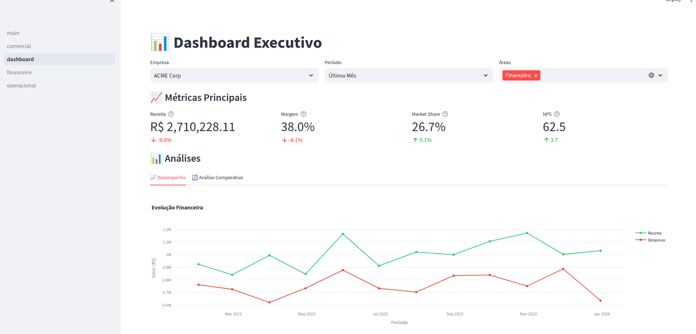
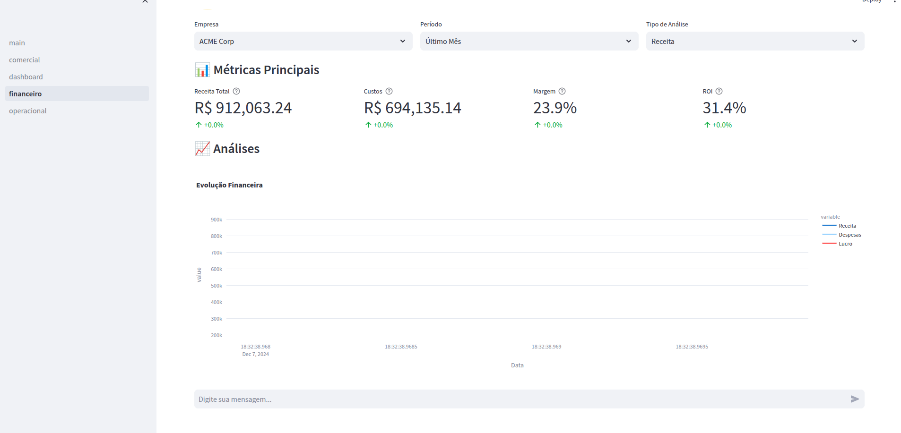
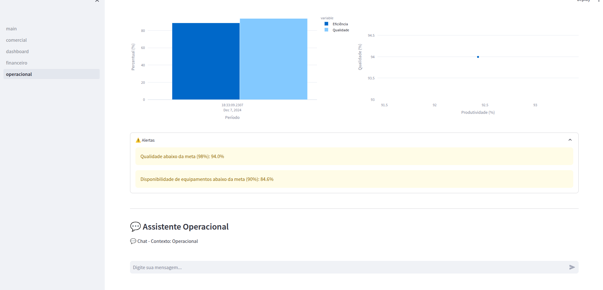
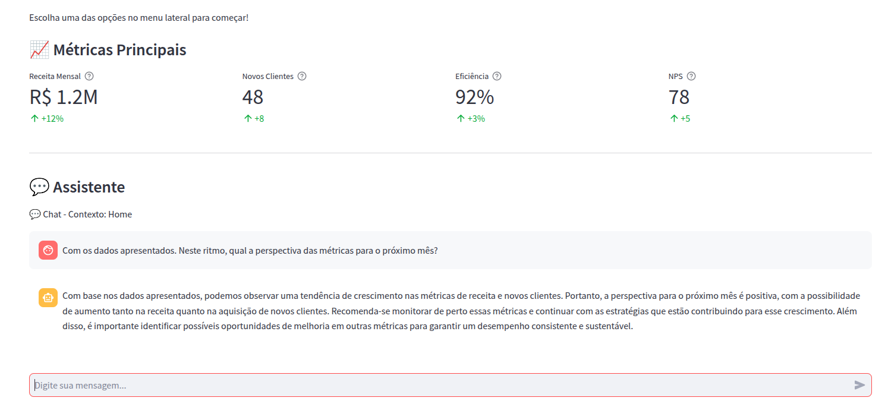

# 🚀 Business Analytics AI


[](https://www.python.org/downloads/)
[](https://streamlit.io)
[](https://openai.com/blog/openai-api)
[](https://opensource.org/licenses/MIT)
[](https://github.com/psf/black)

🔍 Uma plataforma avançada de análise empresarial potencializada por IA que transforma dados em insights acionáveis.

[Documentação](#documentação) · [Reportar Bug](#reportar-bug) · [Solicitar Feature](#solicitar-feature)

---



## ✨ Destaques

1. 🤖 **Análise Inteligente**: Utiliza OpenAI e LangChain para análises profundas e contextualizadas
2. 📊 **Visualizações Dinâmicas**: Gráficos interativos e dashboards em tempo real
3. 🔐 **Segurança Integrada**: Sistema robusto de autenticação e proteção de dados
4. 🌍 **Multilíngue**: Suporte a múltiplos idiomas para relatórios e análises
5. 📱 **Design Responsivo**: Interface moderna e adaptável a diferentes dispositivos

## 🎯 Principais Funcionalidades

### 🔒 Sistema de Autenticação


1. Login seguro com usuário e senha
2. Proteção de rotas e conteúdo
3. Gerenciamento de sessão de usuário
4. Armazenamento seguro de credenciais

### 📈 Análise Comercial


1. Visualização de dados comerciais detalhados
2. Gráficos interativos com Plotly
3. Análise de diferentes métricas:
    - Vendas por Canal
    - Performance de Produtos
    - Análise de Clientes
    - Eficiência da Força de Vendas
    - Market Share
4. Exportação de dados em CSV
5. Geração de relatórios em diferentes idiomas

### 💰 Análise Financeira



1. Indicadores financeiros chave
2. Análise de rentabilidade
3. Fluxo de caixa
4. Projeções financeiras

### 📊 Dashboard


1. Visão geral do negócio
2. KPIs principais
3. Gráficos e métricas em tempo real

### 🏭 Análise Operacional



1. Eficiência operacional
2. Gestão de recursos
3. Indicadores de produtividade

### 💬 Chat com IA

O sistema possui um assistente virtual especializado em análise empresarial, que pode ajudar com insights e recomendações baseadas nos dados.



1. Assistente virtual integrado
2. Análises contextualizadas
3. Suporte em múltiplos idiomas
4. Geração de relatórios personalizados

## 🛠️ Stack Tecnológico

| Tecnologia | Uso |
|------------|-----|
|  | Backend |
|  | Frontend |
|  | IA & NLP |
|  | Visualizações |
|  | Análise de Dados |

## 📦 Instalação

1. Clone o Repositório

```bash
git clone https://github.com/ricardophg1/langchain.git
cd langchain
```

2.Configure o Ambiente Virtual

```bash
python -m venv .venv
source .venv/bin/activate  # Linux/Mac
# ou
.venv\Scripts\activate  # Windows
```

3.Instale as Dependências

```bash
pip install -r requirements/prod.txt
```

1.Configure as Variáveis de Ambiente

```env
OPENAI_API_KEY=sua_chave_api
APP_USERNAME=seu_usuario
APP_PASSWORD=sua_senha
```

1. Execute a Aplicação

```bash
streamlit run langchain_project/main.py
```

## 🔒 Segurança

1. ✅ Autenticação obrigatória
2. 🔐 Credenciais em variáveis de ambiente
3. 🛡️ Proteção contra acessos não autorizados
4. 🔄 Sessão segura com Streamlit

## 🎨 Interface

1. 📱 Design responsivo
2. 🎯 Interface intuitiva
3. 🧭 Navegação simplificada
4. 🌓 Temas claros e escuros

## 📊 Visualizações

1. 📈 Gráficos interativos
2. 📊 Dashboards dinâmicos
3. 📥 Exportação de dados
4. 📝 Relatórios personalizados

## 🌐 Idiomas Suportados

1. 🇧🇷 Português
2. 🇺🇸 Inglês
3. 🇪🇸 Espanhol
4. 🇫🇷 Francês
5. 🇩🇪 Alemão

## 🤝 Contribuição

Contribuições são bem-vindas! Por favor, leia nosso [Guia de Contribuição](#guia-de-contribuição) antes de submeter um PR.

## 📄 Licença

Este projeto está licenciado sob a [MIT License](#mit-license).

## 📧 Contato

[](https://www.linkedin.com/in/ricardophg-santos/)
[](https://github.com/ricardophg1)

---

[⬆ Voltar ao topo](#-business-analytics-ai)

### Documentação

### Reportar Bug

### Solicitar Feature

### Guia de Contribuição

### MIT License
